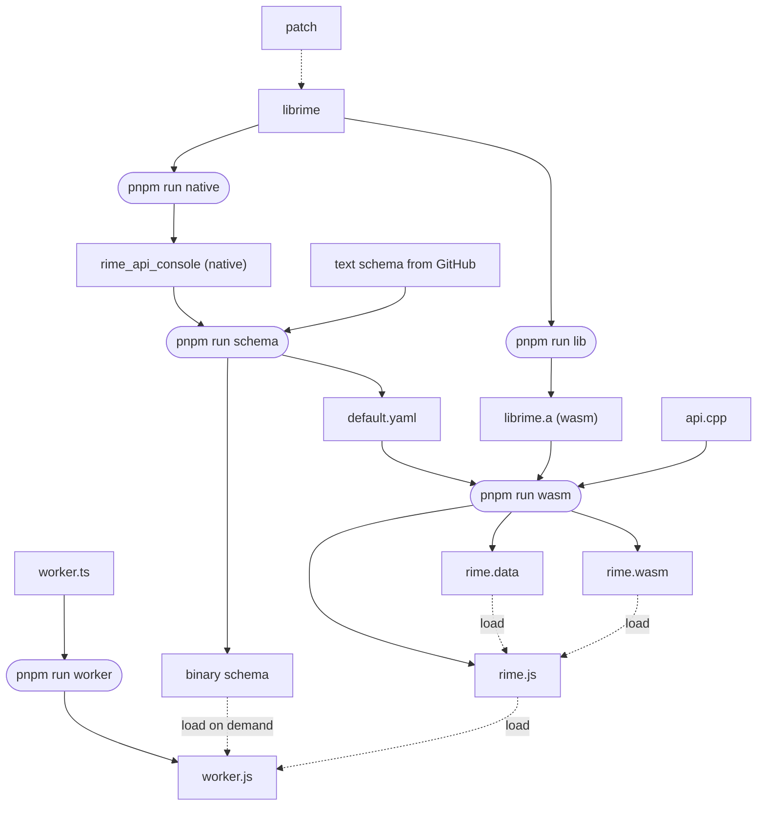
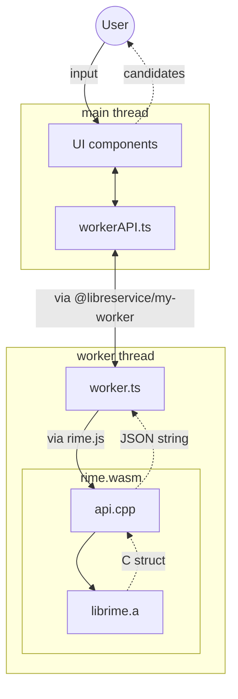

# Develop

## Workflow

```mermaid
flowchart
  patch .-> librime
  librime --> native([pnpm run native]) --> A["rime_api_console (native)"]
  librime --> lib([pnpm run lib]) --> B["librime.a (wasm)"]
  A --> schema([pnpm run schema])
  C[text schema from GitHub] --> schema
  schema --> default.yaml --> wasm
  schema --> D[binary schema]
  B --> wasm([pnpm run wasm])
  api.cpp --> wasm
  wasm --> rime.data
  wasm --> rime.js
  wasm --> rime.wasm
  rime.data .->|load| rime.js
  rime.wasm .->|load| rime.js
  worker.ts --> worker([pnpm run worker]) --> worker.js
  D .->|load on demand| worker.js
  rime.js .->|load| worker.js
```

## Architecture

```mermaid
flowchart
  U((User)) -->|input| A[UI components]
  A .->|candidates| U
  subgraph main thread
  A <--> workerAPI.ts
  end
  workerAPI.ts <-->|"via @libreservice/my-worker"| worker.ts
  subgraph worker thread
  worker.ts
  subgraph rime.wasm
  api.cpp --> librime.a
  librime.a .->|C struct| api.cpp
  end
  worker.ts -->|via rime.js| api.cpp
  api.cpp .->|JSON string| worker.ts
  end
```
